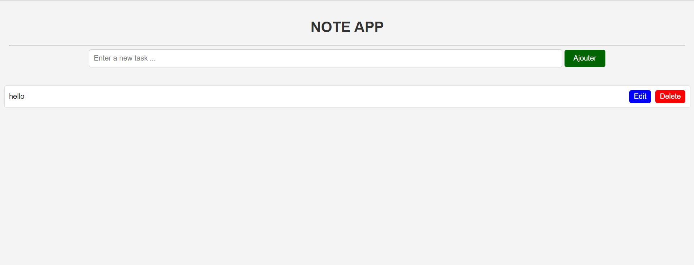

# Note App

A simple Note App that allows users to add, edit, and delete notes. Users can either click the "Ajouter" button or press the "Enter" key to add a note. The app is built with HTML, CSS, and vanilla JavaScript.

## Features

- **Add a New Note**: Use the input field and the "Ajouter" button or press the "Enter" key to add a note.
- **Edit and Delete Notes**:
  - **Edit**: Modify the content of the note.
  - **Delete**: Remove the note from the list.
- **Persist Notes with `localStorage`**: Notes are saved in the browser's local storage, ensuring they remain available between sessions.
- **Animations for Adding and Deleting Notes**: Smooth fade-in and fade-out animations enhance the user experience.
- **Responsive Layout**: Notes are displayed in a simple, responsive layout.
- **Clean, Minimalistic UI**:
  - Green for the "Add" button
  - Blue for "Edit"
  - Red for "Delete"

## How to Use

1. Clone the repository:
   ```bash
   git clone https://github.com/adambour/To-Do-List-JS-.git
   ```

2. Open the `index.html` file in your browser.

3. Start adding, editing, and deleting notes!

## Project Structure

```plaintext
.
├── index.html         # The main HTML file
├── style.css          # The stylesheet for the app
├── app.js             # JavaScript file for note functionality
└── README.md          # Documentation file (this file)
```
## Screen-shot



## Technologies Used

- HTML5
- CSS3
- JavaScript (ES6)

## Future Improvements


---


- Implement Note Sorting and Filtering Options: Enable users to sort notes by date, category, or other criteria, and filter them based on selected categories or tags.
- User Authentication: Implement user login functionality to sync notes across different devices.
- Export/Import Notes: Allow users to export their notes as a file and import them back into the app.
- Rich Text Editing: Enable formatting options for notes, such as bold, italics, and lists.


## Contact

Feel free to reach out if you have any suggestions or improvements:

- **Name**: Adam Bour
- **Email**: [bouradam.adam@gmail.com](mailto:bouradam.adam@gmail.com)
- **LinkedIn**: [Adam Bour](https://linkedin.com/in/adam-bour-9a5020277)
```
